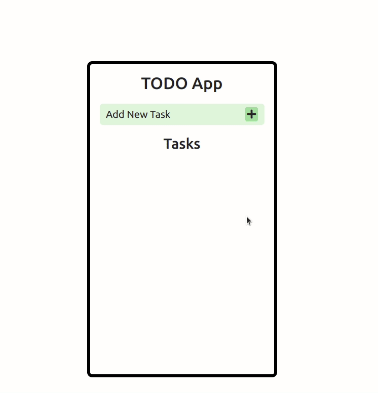

# CRUD TO-DO and Social Media Application

**To-do** and **Social Media app** using "Vanilla JavaScript" and `CRUD` operations.

`CRUD` stands for **CREATE**, **READ**, **UPDATE** and **DELETE** data.

## To-do Application

## Social Media Application

